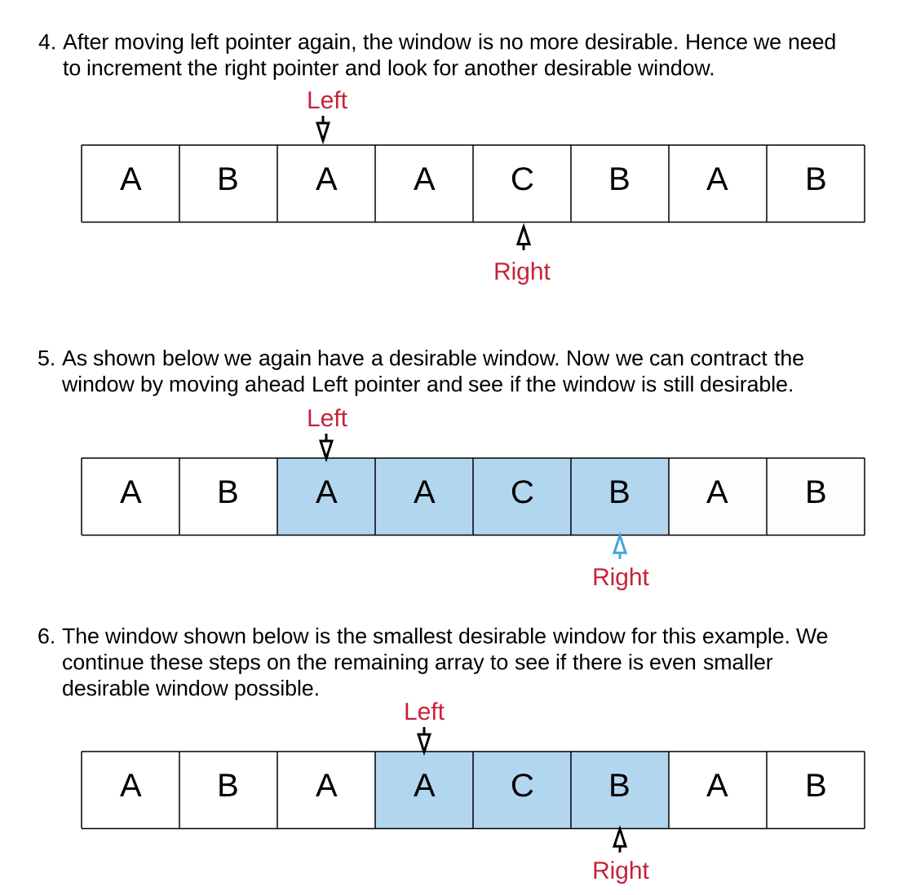

## Link To The Problem 
https://leetcode.com/problems/minimum-window-subsequence/

## Problem Description
Given strings S and T, find the minimum (contiguous) substring W of S, so that T is a subsequence of W.

If there is no such window in S that covers all characters in T, return the empty string "". If there are multiple such minimum-length windows, return the one with the left-most starting index.

Example 1:
```
Input: 
S = "abcdebdde", T = "bde"
Output: "bcde"
Explanation: 
"bcde" is the answer because it occurs before "bdde" which has the same length.
"deb" is not a smaller window because the elements of T in the window must occur in order.
```

Note:
```
All the strings in the input will only contain lowercase letters.
The length of S will be in the range [1, 20000].
The length of T will be in the range [1, 100].
```

## Ideas
We start with two pointers, left and right initially pointing to the first element of the string SS.

We use the right pointer to expand the window until we get a desirable window i.e. a window that contains all of the characters of T.

Once we have a window with all the characters, we can move the left pointer ahead one by one. If the window is still a desirable one we keep on updating the minimum window size.

If the window is not desirable any more, we repeat step 2 onwards.
## Algorithm Analysis
 
 
## Code
```py
class Solution(object):
    def minWindow(self, s, t):
        from collections import Counter
        """
        :type s: str
        :type t: str
        :rtype: str
        """
        if not s or not t:
            return ""
        # a dictionary that stores all t letters
        dict_t = Counter(t) 
        # minimum length of required 
        required = len(dict_t) 
        # left and right pointers
        l, r = 0, 0
        # track number of unique characters in the current window
        formed = 0
        # dictionary to keep count of all unique characters in the current window
        window_counts = {}
        # ans tuple of the form (window length, left, right)
        ans = float("inf"), None, None
        while r < len(s):
            # Add one character from the right to the window:
            character = s[r]
            window_counts[character] = window_counts.get(character, 0) + 1
            # If the frequency of the current character added equals to the desired count in t then increment the formed count by 1.
            if character in dict_t and window_counts[character] == dict_t[character]:
                formed += 1
            # Try and contract the window till the point where it ceases to be 'desirable'.
            while l <= r and formed == required:
                character = s[l]
                # save the smallest window until now
                if r - l + 1 < ans[0]:
                    ans = (r - l + 1, l , r)
                # The character at the position pointed by the `left` pointer is no longer a part of the window.
                window_counts[character] -= 1
                if character in dict_t and window_counts[character] < dict_t[character]:
                    formed -= 1
                 # Move the left pointer ahead, this would help to look for a new window.
                l += 1   
            # keep expanding the window once we are done contracting
            r += 1
        return "" if ans[0] == float("inf") else s[ans[1] : ans[2] + 1]
```
## Complexity Analysis

## Related Topics
```array and strings``` ```hard```


