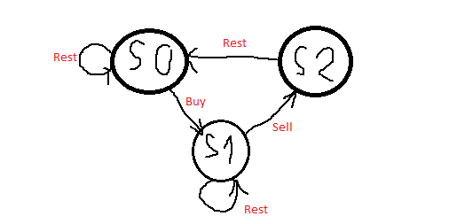

## Link To The Problem 
https://leetcode.com/problems/best-time-to-buy-and-sell-stock-with-cooldown/

## Problem Description
Say you have an array for which the ith element is the price of a given stock on day i.

Design an algorithm to find the maximum profit. You may complete as many transactions as you like (ie, buy one and sell one share of the stock multiple times) with the following restrictions:

You may not engage in multiple transactions at the same time (ie, you must sell the stock before you buy again).
After you sell your stock, you cannot buy stock on next day. (ie, cooldown 1 day)
Example:
```
Input: [1,2,3,0,2]
Output: 3 
Explanation: transactions = [buy, sell, cooldown, buy, sell]
```
## Ideas
There are in total three states: buy, sell, cooldown.

We can create three arrays for each day i, the profit that we make if we buy, sell or cool

The state diagram looks like this:




## Algorithm Analysis

Dynamic programming approach: 

rest[i] = max(rest[i - 1], sell[i - 1])

buy[i] = max(rest[i - 1] - stock[i], buy[i - 1])

sell[i] = max(buy[i - 1] + stock[i], sell[i - 1])

Optimization: use constant variables to remember the prev and curr for each rest, buy and sell.

## Code
approach 1: dynamic programming
```py
class Solution(object):
    def maxProfit(self, prices):
        """
        :type prices: List[int]
        :rtype: int
        """
        if len(prices) < 2:
            return 0
        buy  = [0] * len(prices)
        sell = [0] * len(prices)
        cool = [0] * len(prices)
        buy[0] = -prices[0]
        sell[0] = 0
        cool[0] = 0
        for i in range(1, len(prices)):
            cool[i] = max(sell[i-1], cool[i-1])
            buy[i] = max(buy[i-1], cool[i-1] - prices[i])
            sell[i] = max(sell[i-1], buy[i-1] + prices[i])
        return max(buy[len(prices) - 1], sell[len(prices) - 1], cool[len(prices) - 1])    
    def maxProfit(self, prices):
        """
        :type prices: List[int]
        :rtype: int
        """
        if len(prices) < 2:
            return 0
        prevBuy, currBuy = -prices[0], 0
        prevSell, currSell = 0, 0
        prevCool, currCool = 0, 0
        for i in range(1, len(prices)):
            currCool = max(prevSell, prevCool)
            currBuy = max(prevBuy, prevCool - prices[i])
            currSell = max(prevSell, prevBuy + prices[i])
            
            prevCool = currCool
            prevBuy = currBuy
            prevSell = currSell
        return max(currBuy, currCool, currSell)    
```

## Complexity Analysis
```
Time complexity: O(n)
Space complexity: O(1)
```
## Related Topics
```dynamic programming``` ```medium```


